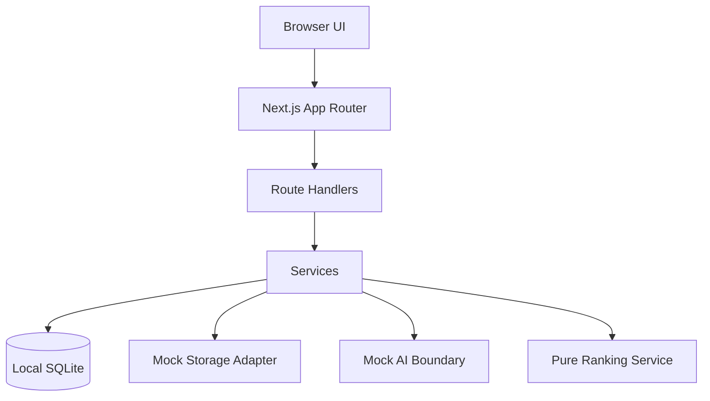

# Architecture

TalentSift Open is a local-first portfolio demo for AI-assisted CV review. The architecture keeps the visible workflow simple while preserving clean boundaries for validation, storage, ranking, and future extraction work.

## Design Goals

- Keep employment-review judgment with the user.
- Make candidate rankings explainable and auditable.
- Run locally without cloud credentials.
- Store only demo analysis state and upload metadata in SQLite.
- Keep source CV text out of logs and out of the current database schema.
- Process TXT CV text in memory for mock extraction and ranking.
- Validate request bodies before service logic runs.
- Keep ranking deterministic and unit-testable.

## Non-Goals

- No automated employment-outcome decisions.
- No real LLM provider in the public demo.
- No cloud database or cloud storage requirement.
- No long-term document storage.
- No use of real candidate documents in fixtures, screenshots, or demos.

## System Overview



## Primary Components

### Web Application

The home screen is the working demo surface:

- Job description input.
- CV file picker.
- Privacy-first toggle.
- Scoring hints.
- Reviewer-facing shortlist output for TXT files processed by the mock
  pipeline.
- Placeholder panel for future side-by-side comparison.

The frontend sends metadata to server APIs and does not import database clients, server-only environment variables, or ranking code that needs to be trusted server-side.

### API Layer

Route handlers validate JSON bodies and return a consistent envelope:

```ts
type ApiResponse<T> = {
  success: boolean
  data?: T
  error?: {
    code: string
    message: string
    details?: unknown
  }
  meta: {
    requestId: string
  }
}
```

Current implemented endpoints:

- `POST /api/analyses`
- `POST /api/analyses/:analysisId/candidates`

### Service Layer

Services coordinate product rules and repositories. They are intentionally small in this portfolio build:

- `AnalysisService` creates local analyses.
- `CandidateService` registers upload metadata for an existing analysis.

### Data Layer

SQLite is the default local persistence layer. The schema is auto-created on first use and mirrored in `sqlite/schema.sql`.

Current tables:

- `analyses`
- `candidates`
- `candidate_documents`

The current schema stores job descriptions and upload metadata. It does not store raw CV text.

Set `DATA_BACKEND=memory` to use the in-memory repositories instead of SQLite.

### Mock Adapters

The project keeps adapter interfaces for storage, parsing, and AI extraction,
but the public demo does not call real providers. This keeps the code
inspectable without requiring API keys or cloud accounts.

Current mock behavior:

- TXT files are decoded in memory.
- PDF files return a clear parser warning because PDF extraction is deferred.
- The mock LLM adapter uses deterministic vocabulary scanning, not real NLP.
- Derived ranking output is returned inline to the UI and is not persisted yet.
  Candidate rows stay in their persisted upload state until a future rankings
  table or status update flow is added.

### Ranking Service

Ranking is a pure TypeScript function. It accepts a scoring config and an extracted profile, then returns:

- Score from 0 to 100.
- Score breakdown.
- Matched skills.
- Missing requirements.
- Short reviewer-facing justification.
- Confidence level.
- Review flags.

Scores are triage aids, not decisions.

## Security Controls

- Validate all request bodies with schemas.
- Keep the demo free of cloud secrets and privileged cloud keys.
- Ignore `.env*`, local SQLite files, logs, build output, coverage, and test artifacts.
- Do not render model or mock output as trusted HTML.
- Do not log raw CV text.
- Do not persist raw CV text.
- Use only synthetic fixtures and screenshots.
- Treat uploaded file names as untrusted display values.

## Deployment Shape

The intended public artifact is a GitHub portfolio repository that runs locally with:

```bash
npm install
cp .env.example .env.local
npm run dev
```

If deployed as a static portfolio preview, keep it in mock mode and avoid collecting real candidate data.
